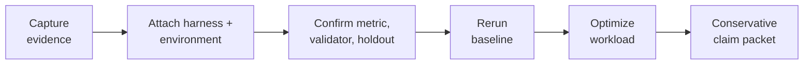

<div align="center">

# Understudy Agent Tools

**Type `/understudy:onboard` in Claude Code — or the matching onboarding
command in your agent — and it walks your LLM app from captured traces to a
measured, cheaper — often local — model, with evidence you can trust.**

[](LICENSE)
[](https://docs.understudylabs.com)
[](skills/README.md)
[](https://www.ycombinator.com)

Works with **Claude Code** · **Cursor** · **Codex** · **OpenCode** · **Hermes Agent** · **Devin**

</div>

---

Understudy is a public, MIT-licensed skill library plus a thin CLI. It gives
your coding agent the playbooks to evaluate an AI workload locally, optimize
it, and route it to a better-value model — **local-first, with no uploads, no
provider calls, and nothing spent by default**.

## Get started (30 seconds)

```bash
curl -fsSL https://raw.githubusercontent.com/UnderstudyLabs/understudy-agent-tools/main/install.sh | bash
```

The installer sets up the CLI, asks which coding agents to attach to (Claude
Code, Cursor, Codex, OpenCode, Hermes Agent, all, or CLI-only), and opens the
selected agent when it can. It installs from the current GitHub `main`
branch: the script clones the source into
`~/.understudy/agent-tools/source/understudy-agent-tools`,
builds the CLI locally, and links the `understudy` command. You do not
need a published npm package.

Then, in Claude Code:

```text
/reload-plugins
/understudy:onboard
```

That's it. Onboarding profiles your machine, interviews you about your
workload, and starts the improvement loop. No registration required. On other
agents the activation command differs slightly — see
[Pick your platform](#pick-your-platform).

> The installer intentionally does **not** download model weights, start MLX,
> launch the ladder server, or make frontier calls. Those happen inside the
> skill flow, where the agent explains tradeoffs and asks consent first.

<details>
<summary><b>Installer options: non-interactive, resume, agent selection, developer install</b></summary>

Non-interactive installs keep script-friendly autodetect behavior:

```bash
curl -fsSL https://raw.githubusercontent.com/UnderstudyLabs/understudy-agent-tools/main/install.sh | bash -s -- --yes
```

Override the agent prompt with
`--agents auto|all|claude-code|cursor|codex|opencode|hermes|devin|none`.

The installer is resumable. It writes step markers under
`~/.understudy/agent-tools/install-state`; after a failed run:

```bash
curl -fsSL https://raw.githubusercontent.com/UnderstudyLabs/understudy-agent-tools/main/install.sh | bash -s -- --resume
```

Or jump directly to a step:

```bash
curl -fsSL https://raw.githubusercontent.com/UnderstudyLabs/understudy-agent-tools/main/install.sh | bash -s -- --from-step 2
```

Developer install from a clone:

```bash
npm install
npm run build
node dist/bin.js --help
```

</details>

## Update Understudy

Rerun the same installer. It replaces the managed GitHub checkout with the
current `main` branch, rebuilds the CLI, and refreshes the selected agent
adapters and skills:

```bash
curl -fsSL https://raw.githubusercontent.com/UnderstudyLabs/understudy-agent-tools/main/install.sh | bash
```

The [`install-agent-adapter`](skills/install-agent-adapter/SKILL.md) skill
repairs or refreshes how an agent discovers the existing skills. It does not
update the underlying checkout by itself. Platforms may still require a
plugin reload, window reload, restart, or new session after an update.

## What it does

- **Captures evidence** from your real LLM traffic — traces, transcripts, or a
  public benchmark — into a local, redacted evidence base.
- **Builds a real eval** — harness, environment, metric, validator, and
  holdout — so improvements are measured, not vibed.
- **Optimizes the workload** — prompt optimization (GEPA/DSPy), local model
  labs, distillation, and RLM training, all runnable on your machine.
- **Picks a route** — compare model sweeps, estimate hosted costs, then ramp a
  percentage of traffic to a cheaper model while the rest stays on your
  current provider.
- **Ships a conservative claim packet** — what changed, how it was measured,
  and what it saves, stated only as strongly as the evidence supports.

The whole OSS loop runs locally and is skill-led:



Registration is not required for that loop. Hosted gateway access is available
after `understudy login`; browser, channel, daemon, and desktop-runtime
commands remain outside this public CLI until intentionally extracted.

## How it's built

Understudy is **agent-platform-neutral at the skill layer**. All six
supported coding agents share the same [`skills/`](skills/) tree and differ
only in a thin adapter: manifest, install path, reload step, and onboarding
invocation. The adapter registry lives in
[`docs/agent-platform-adapters.md`](docs/agent-platform-adapters.md) and is
exposed through `understudy platforms`.

| Spine | Path | Purpose |
| --- | --- | --- |
| CLI | `src/` | Thin TypeScript shortcuts for auth, artifact checks, and durable runs. |
| Skills | `skills/` | MVP progressive-disclosure agent playbooks — **the product**. |
| Docs | `docs/` | Public methodology and release-boundary notes. |
| Platform adapters | `.claude-plugin/`, `.cursor-plugin/`, `.codex-plugin/`, `.opencode/`, `.hermes/`, `.devin/`, `.agents/`, `AGENTS.md` | Thin manifests exposing the same skill tree to each coding-agent surface. |
| Scripts | `scripts/` | Repo hygiene checks, not product CLI code. |

The CLI stays boring on purpose. Workflow judgment belongs in skills; durable
shortcuts belong in TypeScript only when the agent needs reliable execution,
auth injection, artifact writes, or a safety gate.

The hosted surface this CLI consumes is documented at
[docs.understudylabs.com](https://docs.understudylabs.com) — see
[open-source/agent-tools](https://docs.understudylabs.com/open-source/agent-tools)
for how this repo fits the platform and
[open-source/cli](https://docs.understudylabs.com/open-source/cli) for the
command-level CLI reference.

## Pick your platform

The installer autodetects these; each can also be set up by hand. The
[`install-agent-adapter`](skills/install-agent-adapter/SKILL.md) skill contains
the agent-run install/update/verify flow for every platform.

| Agent harness | Default installer behavior | Activation |
| --- | --- | --- |
| Claude Code | Autodetected when `claude` is on `PATH`; installs the local Claude plugin. | Run `/reload-plugins`, then `/understudy:onboard`. |
| Cursor | Autodetected when Cursor is present; links this repo into `~/.cursor/plugins/local/understudy`. | Restart Cursor or run **Developer: Reload Window**, then ask Cursor Agent to use the Understudy onboarding skill. |
| Codex | Autodetected when `codex` is on `PATH`; registers the local Codex marketplace from `.agents/plugins/marketplace.json`. | Run `/plugins`, choose `understudy-skills`, install or enable `understudy`, then start a new thread if needed. |
| OpenCode | Autodetected when `opencode` is on `PATH` or OpenCode config/data exists; links the shared skills into `~/.config/opencode/skills`. | Restart OpenCode or open a new TUI session, then run `/understudy-onboard`. |
| Hermes Agent | Autodetected when `hermes` is on `PATH` or `~/.hermes` exists; registers a stable `~/.understudy/skills` symlink in `skills.external_dirs`. | Run `/reload-skills` (or start a new `hermes` session), then `/onboard` or ask Hermes to use the Understudy onboarding skill. |
| Devin | Autodetected when the `DEVIN` or `DEVIN_SESSION_ID` env var is set or `~/.devin` exists; the installer builds the GitHub source and links the CLI globally. | Ask Devin: *Use the Understudy onboarding skill for this project.* |

Every path is local-only: installing an adapter does not authenticate, upload
data, download model weights, or make provider calls.

<a id="install-as-a-claude-code-plugin"></a>
<details>
<summary><b>Claude Code — install as a plugin (recommended)</b></summary>

The skills in [`skills/`](skills/) ship as a Claude Code plugin, declared in
[`.claude-plugin/`](.claude-plugin/) (`plugin.json` + `marketplace.json`).
Installing it registers the public invocable skills, including the
`understudy` orchestrator, onboarding, capture/eval, optimization, local
model, distillation, RLM, and verifier-handoff workers.

From a clone of this repo:

```bash
claude plugin marketplace add /path/to/understudy-agent-tools
claude plugin install understudy@understudy-skills
```

Then run `/reload-plugins` in your Claude Code session to activate — **no
restart required**. The equivalent interactive flow is `/plugin marketplace add
<path>` then `/plugin install understudy@understudy-skills`. The
[`install-agent-adapter`](skills/install-agent-adapter/SKILL.md) skill automates
this and reports whether the plugin is already installed. The older
[`install-plugin`](skills/install-plugin/SKILL.md) skill remains as a Claude Code
compatibility shim.

After `/reload-plugins`, run `/understudy:onboard`. That is where the coding
agent guides the first local model, launches the ladder climb, and handles any
frontier comparison with explicit consent.

Installing as a plugin is the recommended way to use Understudy: the skills are
what let a coding agent explain what Understudy is and walk you from a trace to
a shipped improvement. It is also fully reversible —

```bash
claude plugin uninstall understudy@understudy-skills
claude plugin marketplace remove understudy-skills
```

— and nothing outside Claude Code's plugin registry is touched.

</details>

<a id="install-as-a-cursor-plugin"></a>
<details>
<summary><b>Cursor — install as a plugin</b></summary>

The same skills ship as a Cursor plugin, declared in
[`.cursor-plugin/plugin.json`](.cursor-plugin/plugin.json). Cursor discovers
the repo's existing [`skills/`](skills/) tree from the plugin root, so there is
no Cursor-specific fork of the playbooks.

For local testing from a clone:

```bash
mkdir -p ~/.cursor/plugins/local
ln -s /path/to/understudy-agent-tools ~/.cursor/plugins/local/understudy
```

Then restart Cursor or run **Developer: Reload Window**. In Cursor Settings ->
Rules, the Understudy skills should appear under Agent Decides. To remove it:

```bash
rm -f ~/.cursor/plugins/local/understudy
```

The [`install-agent-adapter`](skills/install-agent-adapter/SKILL.md) skill
contains the agent-run install/update/verify flow; ask for platform `cursor`.
The older [`install-cursor-plugin`](skills/install-cursor-plugin/SKILL.md) skill
remains as a compatibility shim.

</details>

<a id="install-as-a-codex-plugin"></a>
<details>
<summary><b>Codex — install as a plugin</b></summary>

The same skills ship as a Codex plugin, declared in
[`.codex-plugin/plugin.json`](.codex-plugin/plugin.json) and exposed through the
repo marketplace at
[`.agents/plugins/marketplace.json`](.agents/plugins/marketplace.json). The
plugin points at the repo's existing [`skills/`](skills/) tree.

From a clone of this repo:

```bash
codex plugin marketplace add /path/to/understudy-agent-tools
```

Then open Codex, run `/plugins`, choose the `understudy-skills` marketplace, and
install or enable the `understudy` plugin. The
[`install-agent-adapter`](skills/install-agent-adapter/SKILL.md) skill contains
the agent-run registration/verify flow; ask for platform `codex`. The older
[`install-codex-plugin`](skills/install-codex-plugin/SKILL.md) skill remains as
a compatibility shim.

To remove the marketplace registration:

```bash
codex plugin marketplace remove understudy-skills
```

`AGENTS.md` remains repo guidance for Codex, but the Codex plugin is the
reusable distribution unit for the skills.

</details>

<a id="install-as-opencode-skills"></a>
<details>
<summary><b>OpenCode — install as skills</b></summary>

OpenCode loads `SKILL.md` files natively. This repo exposes the shared skill
tree through [`.opencode/skills`](.opencode/skills), a symlink to
[`skills/`](skills/), and ships a small
[`/understudy-onboard`](.opencode/commands/understudy-onboard.md) command.

This is an OpenCode skills/commands adapter, not an OpenCode JS/TS plugin.
OpenCode plugins are for lifecycle hooks and custom behavior; Understudy only
needs native skill discovery plus a command that routes into onboarding.
[`.opencode/adapter.json`](.opencode/adapter.json) is an Understudy
version/staleness sentinel for release checks, not a manifest consumed by
OpenCode.

For global local testing from a clone:

```bash
mkdir -p ~/.config/opencode/skills ~/.config/opencode/commands
for skill in /path/to/understudy-agent-tools/skills/*; do
  [ -f "$skill/SKILL.md" ] || continue
  dest=~/.config/opencode/skills/"$(basename "$skill")"
  [ -e "$dest" ] || [ -L "$dest" ] || ln -s "$skill" "$dest"
done
[ -e ~/.config/opencode/commands/understudy-onboard.md ] || \
  ln -s /path/to/understudy-agent-tools/.opencode/commands/understudy-onboard.md \
    ~/.config/opencode/commands/understudy-onboard.md
```

Then restart OpenCode or open a new TUI session and run:

```text
/understudy-onboard
```

The [`install-agent-adapter`](skills/install-agent-adapter/SKILL.md) skill
contains the agent-run install/update/verify flow; ask for platform `opencode`.
The older [`install-opencode-plugin`](skills/install-opencode-plugin/SKILL.md)
skill remains as a compatibility shim for the old name. Because symlink targets
can live outside the current project, OpenCode may ask before reading linked
external resources.

To remove Understudy-owned symlinks:

```bash
find ~/.config/opencode/skills -type l -lname '*/understudy-agent-tools/skills/*' -delete
rm -f ~/.config/opencode/commands/understudy-onboard.md
```

</details>

<a id="install-as-hermes-skills"></a>
<details>
<summary><b>Hermes Agent — install as skills</b></summary>

Hermes Agent (Nous Research) loads `SKILL.md` files natively and scans any
directory listed in `skills.external_dirs` in `~/.hermes/config.yaml`. The
shared skill tree already ships valid Hermes skills, so the adapter registers
the directory rather than copying it. To keep the config entry stable across
checkout or package moves, it registers a durable `~/.understudy/skills`
symlink to [`skills/`](skills/) — a path indirection, not a fork.
[`.hermes/adapter.json`](.hermes/adapter.json) is an Understudy
version/staleness sentinel for release checks, not a manifest consumed by
Hermes.

For global local testing from a clone:

```bash
REPO=/path/to/understudy-agent-tools
LINK="$HOME/.understudy/skills"
mkdir -p "$HOME/.understudy"
[ -e "$LINK" ] || ln -s "$REPO/skills" "$LINK"
python3 - "${HERMES_HOME:-$HOME/.hermes}/config.yaml" "$LINK" <<'PY'
import sys, os, yaml
p, d = sys.argv[1], sys.argv[2]
c = (yaml.safe_load(open(p)) or {}) if os.path.exists(p) else {}
s = c.get("skills") if isinstance(c.get("skills"), dict) else {}
c["skills"] = s
e = s.get("external_dirs") or []
e = [e] if isinstance(e, str) else (e if isinstance(e, list) else [])
if d not in e:
    e.append(d)
s["external_dirs"] = e
os.makedirs(os.path.dirname(p) or ".", exist_ok=True)
yaml.safe_dump(c, open(p, "w"), sort_keys=False)
PY
```

Then, in Hermes, rescan without restarting and start onboarding:

```text
/reload-skills
/onboard
```

The [`install-agent-adapter`](skills/install-agent-adapter/SKILL.md) skill
contains the agent-run install/update/verify flow; ask for platform `hermes`.
Local `~/.hermes/skills/` entries win on name conflicts, so a few generically
named skills may be shadowed by Hermes bundled skills.

To remove the registration, drop the entry from `skills.external_dirs` and the
symlink:

```bash
CONFIG="${HERMES_HOME:-$HOME/.hermes}/config.yaml"
LINK="$HOME/.understudy/skills"
python3 - "$CONFIG" "$LINK" <<'PY'
import sys, os, yaml
p, d = sys.argv[1], sys.argv[2]
c = (yaml.safe_load(open(p)) or {}) if os.path.exists(p) else {}
s = c.get("skills") if isinstance(c.get("skills"), dict) else {}
e = s.get("external_dirs") or []
e = [e] if isinstance(e, str) else (e if isinstance(e, list) else [])
s["external_dirs"] = [x for x in e if x != d]
yaml.safe_dump(c, open(p, "w"), sort_keys=False)
PY
[ -L "$LINK" ] && rm -f "$LINK"
```

</details>

<details>
<summary><b>Devin — install as a global CLI</b></summary>

Devin is a cloud-based coding agent: each session boots from a snapshot, so the
install surface is a global CLI rather than a local plugin registration. The
public installer clones the reviewed GitHub source, builds it, and globally
links the CLI. Devin reads `AGENTS.md` as an
injected repository rule and accesses the shared [`skills/`](skills/) tree
directly from that checkout.
[`.devin/adapter.json`](.devin/adapter.json) is an Understudy version/staleness
sentinel for release checks, not a manifest consumed by Devin.

Install the CLI without launching an interactive local agent (typically add
the same command to the Devin environment blueprint for persistence):

```bash
curl -fsSL https://raw.githubusercontent.com/UnderstudyLabs/understudy-agent-tools/main/install.sh \
  | bash -s -- --yes --agents devin --no-launch-agent
```

Then ask Devin:

```text
Use the Understudy onboarding skill for this project.
```

The [`install-agent-adapter`](skills/install-agent-adapter/SKILL.md) skill
contains the agent-run install/verify flow; ask for platform `devin`. This path
is local-only: installing the CLI does not authenticate, upload data, download
model weights, or make provider calls.

To remove:

```bash
npm uninstall -g @understudylabs/understudy-agent-tools
```

</details>

Use the platform registry to see the current install/reload surface across
agent clients:

```bash
understudy platforms
understudy platforms --inspect claude-code
understudy --json platforms
```

## First commands

```bash
understudy spine              # prints the public workflow
understudy skills --list      # list every installed skill
understudy skills --search gateway
understudy platforms          # supported agent adapters
understudy doctor             # local environment check
understudy models runtime doctor  # verify the pinned Apple Silicon VLM engine
```

`spine` prints the public workflow and points agents at
`skills/understudy/SKILL.md`.

Understudy Desktop does not depend on a user's global Python environment. On
Apple Silicon, `understudy models runtime install` creates a private,
commit-pinned MLX/VLM engine under `~/.understudy`; `doctor` verifies its
provenance and the required Gemma compatibility fix, and `repair` reinstalls
that exact runtime when first-use diagnostics fail.

When Desktop is running, agents can use its authenticated local control plane
without discovering ports or handling tokens themselves:

```bash
understudy desktop contract --json
understudy desktop capabilities
understudy desktop status --json
understudy desktop model catalog --json
understudy desktop download start understudy-small
understudy desktop download status <download-id> --json
understudy desktop slot add --json
understudy desktop slot assign <slot-id> understudy-small
understudy desktop slot warm <slot-id>
understudy desktop chat --slot 9 --session my-task --run-id my-task-1 "Inspect this"
understudy desktop chat --slot 9 --supervisor-slot 5 "Let the small model work first"
understudy desktop chat --slot 9 --image screenshot.png "What is wrong here?"
understudy desktop run cancel my-task-1
understudy desktop run events my-task-1 --json
understudy desktop supervisor-feedback --session my-task --run-id my-task-1 \
  --marker my-task-1:intervention:0 --stage take_over --correct-action continue
understudy desktop supervisor-feedback --session my-task --run-id my-task-1 \
  --marker my-task-1:verdict:0 --stage stop --correct-action interrupt
understudy desktop supervision export --reviewed-only --json
understudy desktop supervision prepare-proof --proof ~/.understudy/proofs/<proof-id> --json
understudy desktop tool-proof run --suite core \
  --candidate local-main:7 --candidate local-fast:6 --repetitions 1
understudy desktop tool-proof list --json
understudy desktop tool-proof prepare --proof <proof-id> --json
```

The CLI reads the private mode-0600 `~/.understudy/desktop-api.json`, verifies
the recorded PID and loopback health endpoint, and streams the canonical
ConversationRuntime events. The desktop UI, REST API, CLI, and MCP use the same
runtime and exact `run_id`; the CLI does not drive UI controls or create a
second chat harness. `understudy desktop contract` prints the packaged OpenAPI
3.1 contract even when Desktop is not running, so agents can plan calls without
probing private implementation routes or handling the bearer token themselves.
Model inventory, download, and residency commands use the versioned Desktop
REST contract and fall back to the equivalent legacy routes for one release;
they do not duplicate model-process ownership inside the CLI. MCP remains an
adapter for agents that prefer tool calls, not the CLI's hidden transport.
The supervision export is explicit and local-only. It writes content-addressed,
owner-only correction-pair JSONL and metrics under
`~/.understudy/exports/supervision/` without printing prompt or completion
payloads to the terminal. Metrics use only provider-complete role attribution;
missing or estimated usage is counted as excluded rather than treated as zero.
The export also reports incomplete interventions and any journal or intervention
rows omitted by its bounded recent-evidence window, so aggregates are never
presented as all-time metrics when the safety cap was reached.
`supervision prepare-proof` joins only exact proof/run/session/marker identities
to those canonical pairs. It records deterministic structured-output scores
separately from human judgment, keeps promotion and smoke proofs
evaluation-only, and emits training-eligible rows only for a separately
declared train or development split. The content-addressed JSONL and manifest
remain owner-only and local; the command performs no upload. When at least two
eligible rows exist, the same command also prepares an owner-only DSPy/GEPA
handoff with a deterministic 75/25 train/dev split. Its inputs preserve the
small-model partial, supervisor reason, and failed teacher attempt; its target
is the frozen expected JSON. The handoff is preparation only: it performs no
provider call and never admits promotion or smoke rows.
Executing the provider-backed DSPy adapter additionally requires an approved
dollar cap and explicit input/output token prices. Before every request, the
runtime reserves a conservative upper bound from the serialized input bytes and
the configured output-token ceiling; it disables client-side retries and stops
before a request whose reservation could exceed the cap. Candidate, proof, and terminal
run-state artifacts record the cumulative reservation, metered token
attribution, and user-supplied price basis. This is a fail-closed cap under that
declared basis, not a claim about the provider's final invoice.
The strict tool proof is also local-only: Pi runs each selected model serially,
the CLI restores the previous residency set in a `finally` path, and promotion
requires the frozen 30-task suite repeated three times with complete owner-only
result and canonical-event evidence. Failed exact calls can be projected into
an immutable GEPA-first improvement packet without uploading local traces.

## The skill tree

`skills/understudy/SKILL.md` is the public entrypoint. It routes to exactly
one capability worker per intent, grouped by journey stage; deeper playbooks
live in each skill's `references/` directory:

| Stage | Skills |
| --- | --- |
| **Setup & first run** | install-agent-adapter, compatibility install shims, onboard, ladder (the onboarding "climb") |
| **Understand & capture** | understand-workload, export-trace, ingest-traces (incl. the capture-directory profiler), capture-evidence (incl. the public-benchmark on-ramp), design-simulated-environment |
| **Local models** | manage-local-models, run-local-model-lab, recursive-language-model (incl. RLM pedagogical training) |
| **Compare & diagnose** | compare-model-sweep, compare-trajectories |
| **Plan hosted runs** | plan-hosted-run (provider routing + cost estimation) |
| **Optimize** | optimize-workload, optimize-agentic-workload (read-only search loops and state-mutating API workflows) |
| **Train locally** | curate-trajectories, distill-classifier, local-distillation-lab (incl. the pedagogical arm) |
| **RL handoff** | prepare-verifier-handoff (decide → author env → package → hand off) |
| **Gateway & routing** | use-understudy-gateway (incl. the frontier-keys decision), ramp-and-verify, check-routing-health (self-service diagnostics) |

[`skills/README.md`](skills/README.md) is the authoritative index with
per-skill descriptions — keep it in sync when adding skills. See
[`docs/current-functionality.md`](docs/current-functionality.md) for the
migration ledger.

<details>
<summary><b>Skill design notes: handoff-only skills, optimizer boundary, benchmarks</b></summary>

`prepare-verifier-handoff` is intentionally handoff-only. It is for workloads
that need a future Understudy verifier/RL-environment release or an external
partner path after local validation and prompt optimization are insufficient.
Prime Intellect Verifiers is the current preferred referral for that rung.

Optimizer implementation stays upstream. Do not vendor GEPA or add the full
private runtime as a dependency. The implementation contract is documented in
[`docs/optimize-workload-contract.md`](docs/optimize-workload-contract.md),
the evidence-ladder methodology behind it in
[`docs/methodology-framework.md`](docs/methodology-framework.md). The
TypeScript-to-`uv` Python bridge pattern is documented in
[`docs/uv-python-bridge.md`](docs/uv-python-bridge.md).

**Public benchmark golden path.** For a public demo or agent smoke test, use
the public-benchmark on-ramp in
[`skills/capture-evidence/references/public-benchmark-path.md`](skills/capture-evidence/references/public-benchmark-path.md).
It points agents at public upstream benchmarks such as
[Zapier AutomationBench](https://github.com/zapier/AutomationBench) and
[Harvey LAB](https://github.com/harveyai/harvey-labs). Keep benchmark harnesses
upstream; use Understudy for capture, splits, baselines, optimization, and
conservative claims.

</details>

## Going hosted (optional)

Everything above runs without an account. When you want the hosted gateway,
the first auth journey is intentionally narrow:

```bash
understudy login --email you@company.com   # emails a one-time code
understudy login --code 123456             # completes sign-in (non-TTY shells)
understudy doctor --hosted
understudy workloads list
understudy workloads create classify --capture
understudy gateway probe --provider anthropic --project rehearsal --workload classify
understudy captures list --project rehearsal --workload classify
understudy captures export --request-ids-file request-ids.txt --project rehearsal --out .understudy/capture-batch --include-payload --yes
understudy traces export <trace-id> --project rehearsal --out .understudy/trace-exports --include-payload --yes
understudy traces export --trace-ids-file trace-ids.txt --project rehearsal --out .understudy/trace-exports --include-payload --yes
understudy routes set classify --project rehearsal --model-id glm-5.1 --traffic-pct 10
understudy routes show classify --project rehearsal
understudy routes clear classify --project rehearsal
```

`routes set` writes control-plane route config: your application keeps calling
the normal gateway while a percentage of traffic goes to the selected
Understudy model and the rest remains passthrough/frontier.

<details>
<summary><b>How login, doctor, probes, captures, and routes behave</b></summary>

`login --email` uses the Understudy email-code registration flow. In an
interactive terminal it prompts for the code inline; in a non-TTY shell (a
coding agent, a script) it sends the code and exits, and `login --code`
completes the pending sign-in — so an agent can drive sign-up as two plain
shell commands. It stores the returned `sk_*` in
`~/.understudy/credentials.json` with mode `600` and writes a repo-local
`.understudy/config.json` when the platform returns a default project. `run`
injects `UNDERSTUDY_API_KEY`, `UNDERSTUDY_GATEWAY_URL`, and the non-secret
`UNDERSTUDY_ORG_ID` when known into the child process; do not copy secrets
into repo files or chat output.

`doctor --hosted` checks credentials, gateway health, projects, keys, models,
and workloads without provider calls. `gateway probe` is an explicit tiny live
call and prints request metadata, not the completion text. If you need BYOK for
the probe, pass `--byok-env ENV_NAME`; the CLI reads the key from the
environment and never persists or prints it. `captures list/get` are
metadata-first and redacted by default. Full capture export is opt-in,
file-only, and requires `--include-payload --yes`. For a customer-owned batch,
put one request id per line in a file and pass `--request-ids-file`; the CLI
retries transient failures, resumes from completed files, and writes
`failed-request-ids.txt`. Redacted batch files use `.summary.json`, keeping
them distinct from full-payload `.payload.json` files. `traces export` resolves
one explicit `trace_id` through the customer trace request-ID endpoint, then
reuses that same bounded request exporter for every returned ID. Use a
positional trace ID or an explicit `--trace-ids-file`; there is no unbounded
`--all` trace scan. Each trace writes a private `trace.json` membership manifest,
per-request summary or payload files, `failed-request-ids.txt`, and a batch-level
`failed-trace-ids.txt`. `models list` shows public Understudy model IDs and
display names only.

If the coding agent has an approved native email connector, it may complete the
email-code prompt by reading the fresh Understudy sign-in email directly. The
agent should search only for the current login email, use the code once, and
not print the code or retain it in artifacts.

The hosted contracts behind these commands are documented on the docs site: the
[control-plane API](https://docs.understudylabs.com/reference/control-plane)
(what `workloads`, `routes`, and `captures` call), the
[routing](https://docs.understudylabs.com/concepts/routing) and
[capture](https://docs.understudylabs.com/concepts/capture) semantics, the
gateway [request headers](https://docs.understudylabs.com/reference/request-headers)
and [response headers](https://docs.understudylabs.com/reference/response-headers),
and the [CLI command reference](https://docs.understudylabs.com/open-source/cli)
for every command in the journey above.

For agents that read loose `.claude/skills/` directories but not plugins,
`understudy setup` remains as the legacy fallback: it copies the onboarding
skill into `./.claude/skills/` (`--global` for `~/.claude/skills/`). Either
way, then ask the coding agent to convert the current repo to Understudy or
add a thin GEPA/DSPy optimizer. The installed onboarding skill starts by
checking `understudy status --json` and stops with a clear login instruction
if the user is not authenticated.

</details>

## CLI reference

The TypeScript CLI currently owns the public tools surface. Every command
accepts the global `--json` flag (before or after the subcommand) and emits
machine-readable JSON where supported.

<details>
<summary><b>Full command list and CLI boundaries</b></summary>

```text
spine
platforms
skills
doctor
login
logout
status
projects
keys
models
workloads
captures
gateway
routes
setup
setup-code
run
capture-evidence   (alias: understand)
capture-import
optimize-workload
route-decision
value
experiments
next
```

`setup-code` is skill-routed. It does not patch files directly; it tells the
coding agent to use `skills/onboard/setup-code.md` and the matching framework
recipe.

`gateway` is intentionally probe-only: `gateway health` checks healthz and
`gateway probe` sends one explicit tiny request. It is not a daemon, proxy,
browser, chat runtime, or hosted agent surface. Full-runtime command names such
as `browser`, `channels`, `schedule`, `daemon`, `agent`, and `chat` are not
registered in this public CLI. Use `understudy skills --search <query>` to find
the relevant capability skill instead.

For GEPA/DSPy work, the CLI stays as the guide and gate surface while Python is
used only for small local optimizer environments:

```bash
understudy optimize-workload adapter run --repo . --adapter dspy-gepa \
  --samples samples.json --input-keys question --output-keys answer \
  --model student-model --reflection-model reflection-model \
  --budget-usd <approved-usd> \
  --input-usd-per-million <conservative-input-price> \
  --output-usd-per-million <conservative-output-price> \
  --num-threads 1 --execute
```

The adapter creates an approval-gated `uv run --no-project` runtime with exact
`dspy==3.3.0`, `gepa[dspy]==0.1.1`, and `cloudpickle==3.1.2` packages.
Cloudpickle preserves resumable DSPy signature state. That environment, resumable
logs, and owner-only optimizer receipts are local runtime state. They are not
package infrastructure and must not be committed.

For the exact before/after functionality ledger, see
[`docs/current-functionality.md`](docs/current-functionality.md).

</details>

## Privacy

No provider calls, uploads, model downloads, secret-value inspection, or
hosted jobs run by default. After authentication, the CLI emits bounded
product telemetry documented in [`docs/telemetry.md`](docs/telemetry.md);
disable it with `UNDERSTUDY_TELEMETRY=0`.

Read the full policies:

- [`docs/privacy-and-data-boundaries.md`](docs/privacy-and-data-boundaries.md)
- [`docs/security.md`](docs/security.md)
- [`docs/telemetry.md`](docs/telemetry.md)
- [`docs/oss-release-boundary.md`](docs/oss-release-boundary.md)

## Contributing

Agent and contributor conventions live in [`AGENTS.md`](AGENTS.md); the
release process in [`docs/release-checklist.md`](docs/release-checklist.md).
Release archives should pass:

```bash
npm run check
```

**Do not commit:** customer names, domains, prompts, completions, traces, or
datasets; private repo paths or internal-only runbooks; API keys, tokens,
provider secrets, or local env files; hosted production URLs except documented
public defaults.

**Do commit:** local-only TypeScript CLI code, public agent skills, synthetic
templates and docs, and reproducible
command outputs that do not contain private payloads.

## License

MIT.
