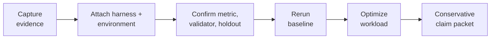

<div align="center">

# Understudy Agent Tools

**Type `/understudy:onboard` in Claude Code — or the matching onboarding
command in your agent — and it walks your LLM app from captured traces to a
measured, cheaper — often local — model, with evidence you can trust.**

[](LICENSE)
[](https://docs.understudylabs.com)
[](skills/README.md)
[](https://www.ycombinator.com)

Works with **Claude Code** · **Cursor** · **Codex** · **OpenCode** · **Hermes Agent** · **Devin**

</div>

---

Understudy is a public, MIT-licensed skill library plus a thin CLI. It gives
your coding agent the playbooks to evaluate an AI workload locally, optimize
it, and route it to a better-value model — **local-first, with no uploads, no
provider calls, and nothing spent by default**.

## Get started (30 seconds)

```bash
curl -fsSL https://raw.githubusercontent.com/UnderstudyLabs/understudy-agent-tools/main/install.sh | bash
```

The installer sets up the CLI, asks which coding agents to attach to (Claude
Code, Cursor, Codex, OpenCode, Hermes Agent, all, or CLI-only), and opens the
selected agent when it can. It installs from the current GitHub `main`
branch: the script clones the source into
`~/.understudy/agent-tools/source/understudy-agent-tools`,
builds and packs the CLI locally, installs the resulting tarball, and removes
the temporary checkout. You do not need a published npm package.

The default install uses the smaller Vercel conversation backend. The optional
Pi backend can be added later without reinstalling Understudy:

```bash
npm install -g @earendil-works/pi-ai@0.80.6 @earendil-works/pi-coding-agent@0.80.6
```

Then, in Claude Code:

```text
/reload-plugins
/understudy:onboard
```

That's it. Onboarding profiles your machine, interviews you about your
workload, and starts the improvement loop. No registration required. On other
agents the activation command differs slightly — see
[Pick your platform](#pick-your-platform).

> The installer intentionally does **not** download model weights, start MLX,
> launch the ladder server, or make frontier calls. Those happen inside the
> skill flow, where the agent explains tradeoffs and asks consent first.

<details>
<summary><b>Installer options: non-interactive, resume, agent selection, developer install</b></summary>

Non-interactive installs keep script-friendly autodetect behavior:

```bash
curl -fsSL https://raw.githubusercontent.com/UnderstudyLabs/understudy-agent-tools/main/install.sh | bash -s -- --yes
```

Override the agent prompt with
`--agents auto|all|claude-code|cursor|codex|opencode|hermes|devin|none`.

The installer is resumable. It writes step markers under
`~/.understudy/agent-tools/install-state`; after a failed run:

```bash
curl -fsSL https://raw.githubusercontent.com/UnderstudyLabs/understudy-agent-tools/main/install.sh | bash -s -- --resume
```

Or jump directly to a step:

```bash
curl -fsSL https://raw.githubusercontent.com/UnderstudyLabs/understudy-agent-tools/main/install.sh | bash -s -- --from-step 2
```

Developer install from a clone:

```bash
npm install
npm run build
node dist/bin.js --help
```

</details>

## Update Understudy

Rerun the same installer. It replaces the managed GitHub checkout with the
current `main` branch, rebuilds the CLI, and refreshes the selected agent
adapters and skills:

```bash
curl -fsSL https://raw.githubusercontent.com/UnderstudyLabs/understudy-agent-tools/main/install.sh | bash
```

The [`install-agent-adapter`](skills/install-agent-adapter/SKILL.md) skill
repairs or refreshes how an agent discovers the existing skills. It does not
update the underlying checkout by itself. Platforms may still require a
plugin reload, window reload, restart, or new session after an update.

## What it does

- **Captures evidence** from your real LLM traffic — traces, transcripts, or a
  public benchmark — into a local, redacted evidence base.
- **Builds a real eval** — harness, environment, metric, validator, and
  holdout — so improvements are measured, not vibed.
- **Optimizes the workload** — prompt optimization (GEPA/DSPy), local model
  labs, distillation, and RLM training, all runnable on your machine.
- **Picks a route** — compare model sweeps, estimate hosted costs, then ramp a
  percentage of traffic to a cheaper model while the rest stays on your
  current provider.
- **Ships a conservative claim packet** — what changed, how it was measured,
  and what it saves, stated only as strongly as the evidence supports.

The whole OSS loop runs locally and is skill-led:



Registration is not required for that loop. Hosted gateway access is available
after `understudy login`; browser, channel, daemon, and desktop-runtime
commands remain outside this public CLI until intentionally extracted.

## How it's built

Understudy is **agent-platform-neutral at the skill layer**. All six
supported coding agents share the same [`skills/`](skills/) tree and differ
only in a thin adapter: manifest, install path, reload step, and onboarding
invocation. The adapter registry lives in
[`docs/agent-platform-adapters.md`](docs/agent-platform-adapters.md) and is
exposed through `understudy platforms`.

| Spine | Path | Purpose |
| --- | --- | --- |
| CLI | `src/` | Thin TypeScript shortcuts for auth, artifact checks, and durable runs. |
| Skills | `skills/` | MVP progressive-disclosure agent playbooks — **the product**. |
| Docs | `docs/` | Public methodology and release-boundary notes. |
| Platform adapters | `.claude-plugin/`, `.cursor-plugin/`, `.codex-plugin/`, `.opencode/`, `.hermes/`, `.devin/`, `.agents/`, `AGENTS.md` | Thin manifests exposing the same skill tree to each coding-agent surface. |
| Scripts | `scripts/` | Repo hygiene checks, not product CLI code. |

The CLI stays boring on purpose. Workflow judgment belongs in skills; durable
shortcuts belong in TypeScript only when the agent needs reliable execution,
auth injection, artifact writes, or a safety gate.

The hosted surface this CLI consumes is documented at
[docs.understudylabs.com](https://docs.understudylabs.com) — see
[open-source/agent-tools](https://docs.understudylabs.com/open-source/agent-tools)
for how this repo fits the platform and
[open-source/cli](https://docs.understudylabs.com/open-source/cli) for the
command-level CLI reference.

## Pick your platform

The installer autodetects these; each can also be set up by hand. The
[`install-agent-adapter`](skills/install-agent-adapter/SKILL.md) skill contains
the agent-run install/update/verify flow for every platform.

| Agent harness | Default installer behavior | Activation |
| --- | --- | --- |
| Claude Code | Autodetected when `claude` is on `PATH`; installs the local Claude plugin. | Run `/reload-plugins`, then `/understudy:onboard`. |
| Cursor | Autodetected when Cursor is present; links this repo into `~/.cursor/plugins/local/understudy`. | Restart Cursor or run **Developer: Reload Window**, then ask Cursor Agent to use the Understudy onboarding skill. |
| Codex | Autodetected when `codex` is on `PATH`; registers the local Codex marketplace from `.agents/plugins/marketplace.json`. | Run `/plugins`, choose `understudy-skills`, install or enable `understudy`, then start a new thread if needed. |
| OpenCode | Autodetected when `opencode` is on `PATH` or OpenCode config/data exists; links the shared skills into `~/.config/opencode/skills`. | Restart OpenCode or open a new TUI session, then run `/understudy-onboard`. |
| Hermes Agent | Autodetected when `hermes` is on `PATH` or `~/.hermes` exists; registers a stable `~/.understudy/skills` symlink in `skills.external_dirs`. | Run `/reload-skills` (or start a new `hermes` session), then `/onboard` or ask Hermes to use the Understudy onboarding skill. |
| Devin | Autodetected when the `DEVIN` or `DEVIN_SESSION_ID` env var is set or `~/.devin` exists; the installer builds the GitHub source and links the CLI globally. | Ask Devin: *Use the Understudy onboarding skill for this project.* |

Every path is local-only: installing an adapter does not authenticate, upload
data, download model weights, or make provider calls.

All adapters expose the same skill tree; there are no platform-specific forks.
For manual setup, removal, or adapter internals, see
[`docs/agent-platform-adapters.md`](docs/agent-platform-adapters.md). You can
also inspect the live registry from the CLI:

```bash
understudy platforms
understudy platforms --inspect claude-code
understudy --json platforms
```

## First commands

```bash
understudy spine              # prints the public workflow
understudy skills --list      # list every installed skill
understudy skills --search gateway
understudy platforms          # supported agent adapters
understudy doctor             # local environment check
understudy models runtime doctor  # verify the pinned Apple Silicon VLM engine
```

`spine` prints the public workflow and points agents at
`skills/understudy/SKILL.md`.

When Understudy Desktop is running, the CLI can inspect its authenticated local
control plane and run models without exposing ports or tokens:

```bash
understudy desktop contract --json
understudy desktop status --json
understudy desktop model catalog --json
understudy desktop chat --slot <slot-id> --session my-task "Inspect this"
```

`understudy desktop contract` prints the packaged OpenAPI 3.1 contract even
when Desktop is not running. Model downloads, supervision exports, proof
preparation, and tool-proof commands are explicit and local-only; use
`understudy desktop --help` for the complete surface.

## The skill tree

`skills/understudy/SKILL.md` is the public entrypoint. It routes to exactly
one capability worker per intent, grouped by journey stage; deeper playbooks
live in each skill's `references/` directory:

| Stage | Skills |
| --- | --- |
| **Setup & first run** | install-agent-adapter, compatibility install shims, onboard, ladder (the onboarding "climb") |
| **Understand & capture** | understand-workload, export-trace, ingest-traces (incl. the capture-directory profiler), capture-evidence (incl. the public-benchmark on-ramp), design-simulated-environment |
| **Local models** | manage-local-models, run-local-model-lab, recursive-language-model (incl. RLM pedagogical training) |
| **Compare & diagnose** | compare-model-sweep, compare-trajectories |
| **Plan hosted runs** | plan-hosted-run (provider routing + cost estimation) |
| **Optimize** | optimize-workload, optimize-agentic-workload (read-only search loops and state-mutating API workflows) |
| **Train locally** | curate-trajectories, distill-classifier, local-distillation-lab (incl. the pedagogical arm) |
| **RL handoff** | prepare-verifier-handoff (decide → author env → package → hand off) |
| **Gateway & routing** | use-understudy-gateway (incl. the frontier-keys decision), ramp-and-verify, check-routing-health (self-service diagnostics) |
| **Writing & papers** | deslop, latex-paper-polish |

[`skills/README.md`](skills/README.md) is the authoritative index with
per-skill descriptions — keep it in sync when adding skills. See
[`docs/current-functionality.md`](docs/current-functionality.md) for the
migration ledger.

<details>
<summary><b>Skill design notes: handoff-only skills, optimizer boundary, benchmarks</b></summary>

`prepare-verifier-handoff` is intentionally handoff-only. It is for workloads
that need a future Understudy verifier/RL-environment release or an external
partner path after local validation and prompt optimization are insufficient.
Prime Intellect Verifiers is the current preferred referral for that rung.

Optimizer implementation stays upstream. Do not vendor GEPA or add the full
private runtime as a dependency. The implementation contract is documented in
[`docs/optimize-workload-contract.md`](docs/optimize-workload-contract.md),
the evidence-ladder methodology behind it in
[`docs/methodology-framework.md`](docs/methodology-framework.md). The
TypeScript-to-`uv` Python bridge pattern is documented in
[`docs/uv-python-bridge.md`](docs/uv-python-bridge.md).

**Public benchmark golden path.** For a public demo or agent smoke test, use
the public-benchmark on-ramp in
[`skills/capture-evidence/references/public-benchmark-path.md`](skills/capture-evidence/references/public-benchmark-path.md).
It points agents at public upstream benchmarks such as
[Zapier AutomationBench](https://github.com/zapier/AutomationBench) and
[Harvey LAB](https://github.com/harveyai/harvey-labs). Keep benchmark harnesses
upstream; use Understudy for capture, splits, baselines, optimization, and
conservative claims.

</details>

## Going hosted (optional)

Everything above runs without an account. When you want the hosted gateway,
the first auth journey is intentionally narrow:

```bash
understudy login --email you@company.com   # emails a one-time code
understudy login --code 123456             # completes sign-in (non-TTY shells)
understudy doctor --hosted
understudy workloads list
understudy workloads create classify --capture
understudy gateway probe --provider anthropic --project rehearsal --workload classify
understudy captures list --project rehearsal --workload classify
understudy captures export --request-ids-file request-ids.txt --project rehearsal --out .understudy/capture-batch --include-payload --yes
understudy traces export <trace-id> --project rehearsal --out .understudy/trace-exports --include-payload --yes
understudy traces export --trace-ids-file trace-ids.txt --project rehearsal --out .understudy/trace-exports --include-payload --yes
understudy traces export --project rehearsal --workload classify --date 2026-08-29 --out .understudy/trace-exports/day --include-payload --yes
understudy evals build --project rehearsal --workload classify --name classification-day --out .understudy/evals/classification-day --yes
understudy routes set classify --project rehearsal --model-id glm-5.1 --traffic-pct 10
understudy routes show classify --project rehearsal
understudy routes clear classify --project rehearsal
```

`routes set` writes control-plane route config: your application keeps calling
the normal gateway while a percentage of traffic goes to the selected
Understudy model and the rest remains passthrough/frontier.

<details>
<summary><b>How login, doctor, probes, captures, and routes behave</b></summary>

`login --email` uses the Understudy email-code registration flow. In an
interactive terminal it prompts for the code inline; in a non-TTY shell (a
coding agent, a script) it sends the code and exits, and `login --code`
completes the pending sign-in — so an agent can drive sign-up as two plain
shell commands. It stores the returned `sk_*` in
`~/.understudy/credentials.json` with mode `600` and writes a repo-local
`.understudy/config.json` when the platform returns a default project. `run`
injects `UNDERSTUDY_API_KEY`, `UNDERSTUDY_GATEWAY_URL`, and the non-secret
`UNDERSTUDY_ORG_ID` when known into the child process; do not copy secrets
into repo files or chat output.

`doctor --hosted` checks credentials, gateway health, projects, keys, models,
and workloads without provider calls. `gateway probe` is an explicit tiny live
call and prints request metadata, not the completion text. If you need BYOK for
the probe, pass `--byok-env ENV_NAME`; the CLI reads the key from the
environment and never persists or prints it. `captures list/get` are
metadata-first and redacted by default. Full capture export is opt-in,
file-only, and requires `--include-payload --yes`. For a customer-owned batch,
put one request id per line in a file and pass `--request-ids-file`; the CLI
retries transient failures, resumes from completed files, and writes
`failed-request-ids.txt`. Redacted batch files use `.summary.json`, keeping
them distinct from full-payload `.payload.json` files. `traces export` can
resolve explicit trace IDs through the customer trace request-ID endpoint, or
download exactly one raw workload day through `--workload`. Workload mode uses
the rolling latest 24 hours by default; `--date YYYY-MM-DD` selects a completed
UTC calendar day. There is no unbounded `--all` trace scan. Explicit traces
write a private `trace.json` membership manifest, per-request files, and batch
failure manifests. Workload days write only a final ordered
`source/index.jsonl` and `source/summary.json` after success. `models list`
shows public Understudy model IDs and
display names only.

If the coding agent has an approved native email connector, it may complete the
email-code prompt by reading the fresh Understudy sign-in email directly. The
agent should search only for the current login email, use the code once, and
not print the code or retain it in artifacts.

The hosted contracts behind these commands are documented on the docs site: the
[control-plane API](https://docs.understudylabs.com/reference/control-plane)
(what `workloads`, `routes`, and `captures` call), the
[routing](https://docs.understudylabs.com/concepts/routing) and
[capture](https://docs.understudylabs.com/concepts/capture) semantics, the
gateway [request headers](https://docs.understudylabs.com/reference/request-headers)
and [response headers](https://docs.understudylabs.com/reference/response-headers),
and the [CLI command reference](https://docs.understudylabs.com/open-source/cli)
for every command in the journey above.

For agents that read loose `.claude/skills/` directories but not plugins,
`understudy setup` remains as the legacy fallback: it copies the onboarding
skill into `./.claude/skills/` (`--global` for `~/.claude/skills/`). Either
way, then ask the coding agent to convert the current repo to Understudy or
add a thin GEPA/DSPy optimizer. The installed onboarding skill starts by
checking `understudy status --json` and stops with a clear login instruction
if the user is not authenticated.

</details>

## CLI reference

The TypeScript CLI currently owns the public tools surface. Every command
accepts the global `--json` flag (before or after the subcommand) and emits
machine-readable JSON where supported.

<details>
<summary><b>Full command list and CLI boundaries</b></summary>

```text
spine
platforms
skills
doctor
login
logout
status
projects
keys
models
workloads
captures
gateway
routes
setup
setup-code
run
capture-evidence   (alias: understand)
capture-import
optimize-workload
route-decision
value
experiments
next
```

`setup-code` is skill-routed. It does not patch files directly; it tells the
coding agent to use `skills/onboard/setup-code.md` and the matching framework
recipe.

`gateway` is intentionally probe-only: `gateway health` checks healthz and
`gateway probe` sends one explicit tiny request. It is not a daemon, proxy,
browser, chat runtime, or hosted agent surface. Full-runtime command names such
as `browser`, `channels`, `schedule`, `daemon`, `agent`, and `chat` are not
registered in this public CLI. Use `understudy skills --search <query>` to find
the relevant capability skill instead.

For GEPA/DSPy work, the CLI stays as the guide and gate surface while Python is
used only for small local optimizer environments:

```bash
understudy optimize-workload adapter run --repo . --adapter dspy-gepa \
  --samples samples.json --input-keys question --output-keys answer \
  --model student-model --reflection-model reflection-model \
  --budget-usd <approved-usd> \
  --input-usd-per-million <conservative-input-price> \
  --output-usd-per-million <conservative-output-price> \
  --num-threads 1 --execute
```

The adapter creates an approval-gated `uv run --no-project` runtime with exact
`dspy==3.3.0`, `gepa[dspy]==0.1.1`, and `cloudpickle==3.1.2` packages.
Cloudpickle preserves resumable DSPy signature state. That environment, resumable
logs, and owner-only optimizer receipts are local runtime state. They are not
package infrastructure and must not be committed.

For the exact before/after functionality ledger, see
[`docs/current-functionality.md`](docs/current-functionality.md).

</details>

## Privacy

No provider calls, uploads, model downloads, secret-value inspection, or
hosted jobs run by default. After authentication, the CLI emits bounded
product telemetry documented in [`docs/telemetry.md`](docs/telemetry.md);
disable it with `UNDERSTUDY_TELEMETRY=0`.

Read the full policies:

- [`docs/privacy-and-data-boundaries.md`](docs/privacy-and-data-boundaries.md)
- [`docs/security.md`](docs/security.md)
- [`docs/telemetry.md`](docs/telemetry.md)
- [`docs/oss-release-boundary.md`](docs/oss-release-boundary.md)

## Contributing

Agent and contributor conventions live in [`AGENTS.md`](AGENTS.md); the
release process in [`docs/release-checklist.md`](docs/release-checklist.md).
Release archives should pass:

```bash
npm run check
```

**Do not commit:** customer names, domains, prompts, completions, traces, or
datasets; private repo paths or internal-only runbooks; API keys, tokens,
provider secrets, or local env files; hosted production URLs except documented
public defaults.

**Do commit:** local-only TypeScript CLI code, public agent skills, synthetic
templates and docs, and reproducible
command outputs that do not contain private payloads.

## License

MIT.
