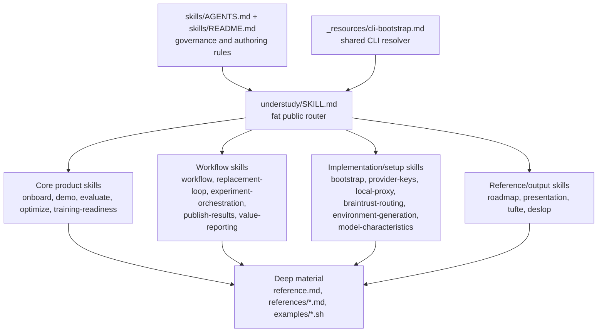
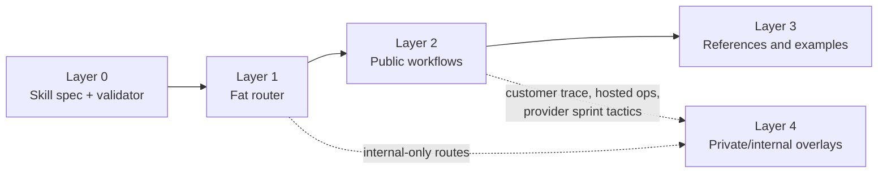

# Skill Externalization Plan

Source reviewed: `understudy-agent/skills` on June 3, 2026.

Goal: externalize the Understudy agent skill library into a public,
MIT-licensed `understudy-agent-tools` repo without leaking customer data,
private operating methodology, provider secrets, or internal hosted-control
mechanics.

## Current Skill Layers



Observed shape:

- `understudy/SKILL.md` is the public router, but it is too large: 1,286 lines.
- Most skills read `_resources/cli-bootstrap.md` before CLI calls.
- Some skills have `reference.md`, `references/`, and `examples/`; this is not
  consistent.
- The Tufte skill has the best progressive-disclosure structure: short
  `SKILL.md`, scoped references, and local examples.

## Target Public Layers



Public repo should ship layers 0-3. Layer 4 stays in private Understudy repos
or private skill packs.

## Public Safety Policy

Public skills may mention:

- local-only evaluation and replay;
- synthetic fixtures and public datasets;
- generic provider setup;
- public vendor documentation;
- approval-gated uploads/spend/training;
- public papers and public open-source dependencies.

Public skills must not include:

- customer names, domains, volumes, traces, prompts, completions, labels, or
  row-level examples;
- internal Super Admin, WorkOS org setup, D1 mutations, R2 capture envelopes,
  pool-secret names, or hosted deployment internals;
- exact private customer replacement methodology such as production route-card
  ETL, RLM profile operations, Modal handoffs, shadow/canary mechanics, or
  customer-specific capture recovery;
- internal sprint doctrine, provider lane bets, or spend heuristics that make
  public agents too aggressive;
- uncited claims about vendor capabilities, pricing, ownership, model
  availability, or hosted API behavior.

## Skill Treatment Matrix

| Skill | Treatment | Notes |
| --- | --- | --- |
| `understudy` | Split and rewrite | Keep as short router. Move long runbook material into public references or private overlays. |
| `understudy-demo` | Copy with light scrub | Good first public skill. Keep bundled/synthetic replay only. |
| `understudy-workflow` | Copy with light scrub | Keep guided replay path. |
| `understudy-bootstrap` | Copy with citation scrub | Remove or verify time-sensitive corporate claims before publishing. |
| `understudy-local-proxy` | Copy with light scrub | Keep local proxy and generic SDK inspection. |
| `understudy-provider-keys` | Copy core, sanitize provider list | Key handling is strong. Remove roadmap labels and unsupported providers. |
| `understudy-tufte` | Copy after license check | Do not vendor upstream Tufte plugin unless license is confirmed. |
| `understudy-deslop` | Copy with MIT attribution | Preserve upstream license and acknowledgments. |
| `understudy-presentation` | Copy after source check | Cite frontend-slides as inspiration only unless license permits reuse. |
| `understudy-publish-results` | Copy with disclosure checklist | Default private partner volume to scenario analysis. |
| `understudy-value-reporting` | Sanitize | Keep reporting; make safety gates explicit. |
| `understudy-roadmap` | Sanitize | Present providers as examples unless intentional public positioning. |
| `understudy-model-characteristics` | Sanitize and cite | Capability claims drift; cite public docs or make generic. |
| `understudy-evaluate` | Split | Public: conservative eval workflow. Private: aggressive paid sprint/provider tactics. |
| `understudy-optimize` | Split | Public: train/validation/test discipline and local GEPA shape. Private: active sprint tactics. |
| `understudy-training-readiness` | Split | Public: readiness gates. Private: provider-specific launch mechanics. |
| `understudy-replacement-loop` | Split | Public: generic local replacement loop. Private: customer trace ETL, Modal, canary. |
| `understudy-experiment-orchestration` | Keep mostly private | Public can say durable experiment plans and approval gates; keep Smithers/concurrency doctrine private. |
| `understudy-braintrust-routing` | Keep private or rewrite | Public version should cover generic header validation only. |
| `understudy-environment-generation` | Sanitize | Keep generated environment safety; cite public Prime/verifiers docs. |
| `understudy-onboard` | Split | Public first-run onboarding only; hosted customer setup private. |

## Standard Skill Schema

Keep top-level frontmatter compatible with Agent Skills Spec v1.1.
Project-specific metadata goes under `metadata.understudy`.

```yaml
---
name: understudy-<capability>
description: <activation-only description, <=512 preferred, <=1024 enforced>
metadata:
  understudy:
    mode: automatic | interactive | production | reporting
    safety: local-first | approval-required | secrets-handling
    cli_required: true
---
```

Required sections for public implementation skills:

1. `# Understudy <Capability>`
2. `## Resolve CLI`
3. `## Safety Gates`
4. `## Intake`
5. `## Flow`
6. `## References`
7. `## Examples`
8. `## Output Standard`

`SKILL.md` target length: 80-120 lines. If it exceeds 150 lines, move command
matrices and edge cases into `reference.md` or `references/*.md`.

## Validator Requirements

Layer a public-skill validator on top of the Agent Skills Spec validator:

- frontmatter description max 1024 chars; warn above 512;
- require `## Resolve CLI` when `metadata.understudy.cli_required != false`;
- require `## Safety Gates`;
- warn when `SKILL.md` exceeds 150 lines, except the fat router;
- require `reference.md` or `references/` when a skill exceeds 150 lines;
- require at least one local-only example for implementation playbooks;
- block obvious private/customer terms and secret patterns;
- block example scripts that require uploads, provider spend, or customer
  identifiers by default.

## Migration Sequence

1. Establish skeleton in `understudy-agent-tools`: MIT license, CLI spine,
   skill validator, public skill template.
2. Copy the safest skills first:
   - `understudy-demo`
   - `understudy-workflow`
   - `understudy-local-proxy`
   - `understudy-provider-keys` core
   - `understudy-tufte`
   - `understudy-deslop`
3. Rewrite the fat router to 100-150 lines and make it route only to public
   skills.
4. Add sanitized eval/optimize/training-readiness public skills.
5. Add public `publish-results`, `presentation`, and `value-reporting`.
6. Add private overlay support later for internal-only skills, but do not ship
   private overlays in the public repo.

## Public Reference Strategy

Use public docs and source links for:

- Agent Skills Spec;
- AutomationBench;
- GEPA/DSPy where used;
- provider API docs for Anthropic, OpenAI, Gemini, Fireworks, Together,
  Hugging Face, Vertex, Snowflake, Braintrust;
- Tinker, Prime/verifiers/renderers only where public docs and licenses are
  verified;
- upstream vendored skills such as `skill-deslop`.

Do not present current provider/model availability from memory. Re-verify
before publishing provider-specific claims.
